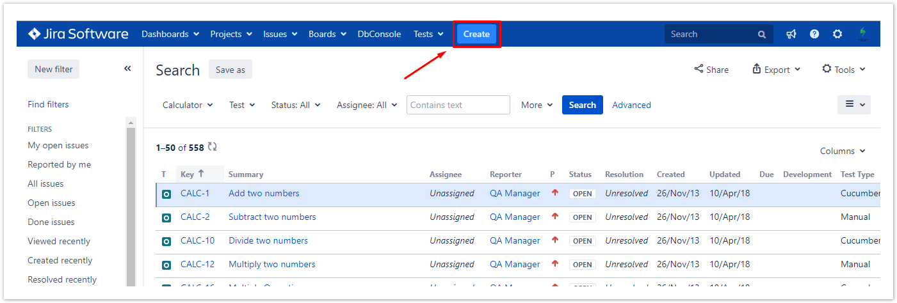
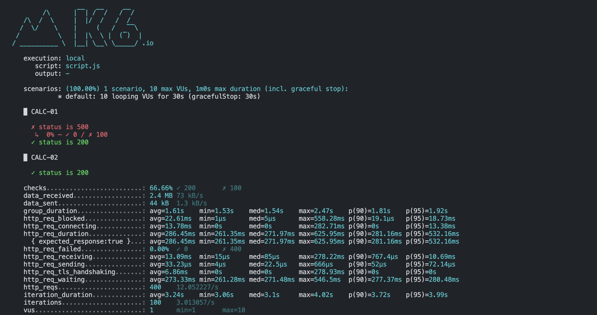

# How to Setup the `generator` Helper Script

``` This script is used to convert the k6 json output to a json format that is compatible with the xray ```

## Prerequisites

- Have [Node.js](https://nodejs.org/en/) installed on your machine.
- Have [npm](https://www.npmjs.com/) installed on your machine.
- Have [k6](https://k6.io/docs/getting-started/installation) installed on your machine.

## Usage

``` If you have your k6 tests organised in groups and each group title is the name of the test which is also tied to a test case on xray, you can use the generator script to generate a json file that is compatible with xray. ```
 <!--Example  -->
> Example: The below image from xray docs shows the test cases on xray with test keys as `CALC-01,CALC-02`.
> 


> Therefore in your k6 test script, you can have the group title as `CALC-01` and `CALC-02` . The script will search for these group names and assign the test results to the respective test case on xray.
>
> Example:
> ```javascript
> group('CALC-01', function() {
>   // test code
> });
> group('CALC-02', function() {
>   // test code
> });

## Output

``` The output of the script is a json file that is compatible with xray. The json file will be saved in the same directory as the script. ```

## How to setup the script

We shall use the `handleSummary` function provided by k6 and `textSummary` from our `generator.js` script to generate the json file. The `handleSummary` function takes in `data` object which we pass to the `textSummary` to modify it XRAY acceptable format.

[Read more about k6 `HandleSummary` here](https://grafana.com/docs/k6/latest/results-output/end-of-test/custom-summary/)

Example:

```javascript
import http from 'k6/http';
import { sleep, group, check } from 'k6';


import { getSummary } from "./generator.js";
import { textSummary } from "https://jslib.k6.io/k6-summary/0.0.1/index.js";


export const options = {
    vus: 10,
    duration: '30s',
};

export default function() {
group('CALC-01', function() {
    const resp = http.get('http://test.k6.io');
    check(resp, {
        'status is 200': (r) => r.status === 200,
    });
    sleep(1);
});
    
group('CALC-02', function() {
    const resp = http.get('http://test.k6.io');
    check(resp, {
        'status is 200': (r) => r.status === 200,
    });
    sleep(1);
});
};

export function handleSummary(data) {
    return {
        stdout: textSummary(data, { indent: " ", enableColors: true }),
        "summary.json": JSON.stringify(getSummary(data, "CALC-2062", "CALC"), null, 2)
    };
}
```

## Running the script

To run the script, you can use the below command:

```bash
k6 run script.js -e TEST_PLAN_KEY="CALC-2345" -e TEST_EXEC_KEY="CALC-0009"
```

The `TEST_PLAN_KEY` and `TEST_EXEC_KEY` are the keys for the test plan and test execution respectively. The keys are used to identify the test plan and test execution on xray.
Read more about the test plan and test execution keys here:

[Read more here](https://docs.getxray.app/display/XRAY/Test+Execution)

The script will generate a json file that is compatible with xray.

## Output

The output of the script is a json file that is compatible with xray. The json file will be saved in the same directory as the script.

```json
{
  "info": {
    "summary": "K6 Test execution - Mon Sep 09 2024 17:56:13 GMT+0300 (EAT)",
    "description": "This is k6 test with maximum iteration duration of 4.29s, 200 passed requests and 0 failures on checks",
    "user": "k6-user",
    "startDate": "2024-09-09T14:56:13.000Z",
    "finishDate": "2024-09-09T14:56:13.000Z",
    "testPlanKey": "CALC-2345"
  },
  "testExecutionKey": "CALC-0009",
  "tests": [
    {
      "testKey": "CALC-01",
      "start": "2024-09-09T14:56:13.000Z",
      "finish": "2024-09-09T14:56:13.000Z",
      "comment": "Test execution passed",
      "status": "PASSED"
    },
    {
      "testKey": "CALC-02",
      "start": "2024-09-09T14:56:13.000Z",
      "finish": "2024-09-09T14:56:13.000Z",
      "comment": "Test execution passed",
      "status": "PASSED"
    }
  ]
}
```

### What if the one of the test checks inside a group fails?

The script will assign the status of the test to `FAILED` and the comment will be the error message.

Example:

> If you have the folowing code in your k6 script:

```javascript
group('CALC-01', function() {
    const resp = http.get('http://test.k6.io');
    check(resp, {
        'status is 500': (r) => r.status === 500,
    });

    check(resp, {
        'status is 200': (r) => r.status === 200,
    });
    sleep(1);
});
```

> The script will generate the following json output:



> The XRAY json output will be:

```json
{
  "info": {
    "summary": "K6 Test execution - Mon Sep 09 2024 18:18:31 GMT+0300 (EAT)",
    "description": "This is k6 test with maximum iteration duration of 4.02s, 200 passed requests and 100 failures on checks",
    "user": "k6-user",
    "startDate": "2024-09-09T15:18:31.000Z",
    "finishDate": "2024-09-09T15:18:31.000Z",
    "testPlanKey": "CALC-2345"
  },
  "testExecutionKey": "CALC-0009",
  "tests": [
    {
      "testKey": "CALC-02",
      "start": "2024-09-09T15:18:31.000Z",
      "finish": "2024-09-09T15:18:31.000Z",
      "comment": "Test execution passed",
      "status": "PASSED"
    },
    {
      "testKey": "CALC-01",
      "start": "2024-09-09T15:18:31.000Z",
      "finish": "2024-09-09T15:18:31.000Z",
      "comment": "Test execution failed",
      "status": "FAILED"
    }
  ]
}
```
